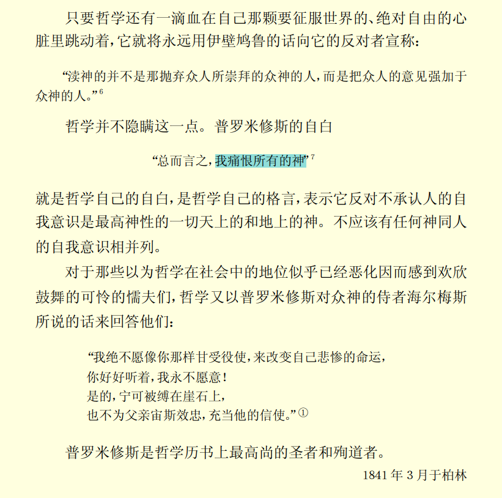

# 小记·德谟克利特的自然哲学和伊壁鸠鲁的自然哲学的差别

阅读版本：[马克思恩格斯全集 第二版 第一卷（上）](https://marx.guat.edu.cn/system/_content/download.jsp?urltype=news.DownloadAttachUrl&owner=1369066848&wbfileid=3804544)

[toc]

### 背景

#### 人物介绍：

##### **德谟克利特 Δημόκριτος**

##### 

- 英译：Democritus
- 古希腊自然派 / 前苏格拉底-原子论者
- 前460年——前370年或前356年
- 来自：古希腊爱琴海北部海岸
- 主要生活时代：希波战争结束后希腊奴隶制社会最为兴旺、科学学术活动欣欣向荣的伯里克利时代
- “原子论”的创始者，由原子论入手，建立认识论。
- 著有《大宇宙》、《小宇宙》、《论荷马》、《节奏与和谐》、《论音乐》、《论诗的美》、《论绘画》等，现存残篇[^1]。

- 主要观点：

  - 原子论 / 原子唯物论：

    1. 认为万物的本源是原子与虚空。

    2. 宇宙的一切事物都是由在虚空中运动着的原子构成。

    3. 原子是一种最后的、不可分的物质微粒，且不可被感官所感知。

    4. 原子处在永恒的运动之中，即运动为原子本身所固有。

    5. 原子不可分割并不完全一样：数量无限，性质相同；相互之间只有形状、次序和位置方面的差别，原子构成事物就如同字母构成单词一样。

    6. 原子受因果必然性决定，在虚空中作直线运动，由于方向不同而相互碰撞，形成漩涡运动并构成万物。

    7. 原子叫做存在，虚空叫做非存在，但非存在不等于不存在，只是相对于有充实性的原子而言，虚空是没有充实性的。非存在与存在都是实在(真实)[^2]的。

    8. 世界是由原子在虚空的漩涡运动中产生的。宇宙中有无数个世界在不断的生成与灭亡。

  - 认识论：人们的认识是从事物中流射出来的原子形成的“影像”作用千人们的感官与心灵而产生的。

  - 伦理观：强调幸福论， 主张道德的标准就是快乐和幸福。
- 当代评价/成就：

  - 认为德谟克利特是自然科学家，主要缘于他对于自然科学起到的奠基作用；但在哲学领域，他是个彻头彻尾的经验论者。德谟克利特
  - 德谟克利特的原子论是希腊自然哲学发展的最高峰，较为完满的解决了一与多、存在与非存在、本原与事物、理性与感觉等重大理论问题，使古希腊的结构自然观达到完备的形态，这种形态首次做到了不用任何神或精神的力量而只凭自然物质本身来解释自然，对后世唯物主义和自然科学研究产生了深远的影响。

[^1]: 必须要指出：没有史实证明过柏拉图烧过德谟克利特的著作；当然，柏拉图与原子论者两方对神与灵魂有着本质上不同的认识，所以柏拉图反感也打压原子论也是事实。
[^2]: 实在（Reality）：该概念源自柏拉图，可理解为"真实"。近代之后，哲学家对何物是“实在”有了很大不同的看法，在“唯物主义者”眼中，“实在”不是什么理念，而是客观事物（或称“客观存在”），这一看法也符合自然科学的世界观。笔者认为“实在”一词在不同文献中有着各不相同的解释，译者应给予其注释。在笔者看来，若无背景或上下文联系“实在”一词，实在不好理解，至少对于笔者而言；私以为这一翻译为了哲学概念所生硬套用的，徒增壁垒。

##### **伊壁鸠鲁 Ἐπίκουρος**

##### 

- 英译：Epicurus
- 古希腊无神论哲学家 / 伊壁鸠鲁学派
- 前341年－前270年
- 来自：萨摩斯岛[^3]
- 伊壁鸠鲁成功地发展了阿瑞斯提普斯的享乐主义，并将之与德谟克利特的原子论结合起来。
- 主要探求个人心灵安宁和人生目的。
- 著有《论自然》、《准则学》、《论生活》、《论目的》等。现存残篇。
- 主要观点：

  - 伊壁鸠鲁否定宗教，否认神是最高的法则制定者，蔑视必然原则。
  - 认为恐惧的两大根源就是宗教与怕死
  - 伊壁鸠鲁快乐主义
    - 认为快乐就是善 —— 快乐就是有福的生活的开端与归宿
    - 区分了动态的快乐和静态的快乐
    - 动态的快乐：指**正在满足[^4]**某一种欲望时产生的快乐，而在此之前是痛苦的。（例如:饿时，获得美食）
    - 静态的快乐：指自身需求达到**平衡状态**所获得的快乐，如果没有满足需求便会渴望，过于满足便会厌恶。（例如：饱腹感）
    - 认为静态的快乐拥有优先的地位，它是“一种厌足状态中的麻醉般的狂喜”
    - 社会快乐：伊壁鸠鲁认为，最可靠的社会快乐[^5]就是友谊
    - 心灵的快乐就是对肉体快乐的观赏。心灵的快乐之唯一高出于肉体快乐的地方，就是我们可以学会观赏快乐而不观赏痛苦
  - 伊壁鸠鲁原子学说
    - 伊壁鸠鲁相信德谟克利特的原子论，但他并不认为原子的运动受各种自然法则的支配。
    - 认同德谟克利特原子具有重量，并且不断地向下坠落的观点；但补充道：原子不是朝向地心坠落，而是一种绝对意义的向下坠落
    - 认为：一个原子时时会受到有似于自由意志的某种东西在作用着，于是就微微地脱离了一直向下的轨道，而与其他的原子相冲撞。
    - 灵魂是物质的，是由呼吸与热那类的微粒所组成的。

[^3]: 萨摩斯岛(Σάμος)：希腊第9大岛屿，在古希腊时代，萨摩斯岛是一富有和强大的城市，为伊奥尼亚文化的中心。伊奥尼亚或爱奥尼亚(古希腊语：Ἰωνία)：古希腊时代对今天土耳其安纳托利亚西南海岸地区的称呼。
[^4]: 笔者认为“正在满足”这一词应当不仅表明了动态快乐产生的阶段，还表现出快乐程度的随着达成“愿望”、享受/使用“愿望”、对该“愿望”习以为常……这整个过程的变化态势。个人认为这种随过程而发生较剧烈变化的特点，才是区分动静态快乐的关键所在。

[^5]: 并未发现“社会快乐”的具体含义，或许泛指社交、生产、生活等

### 体会

肯定要承认的是，对于笔者这样一个哲学领域的门外汉而言，阅读这篇博士论文的体验着实说不上好。

未曾接触过的生涩人名、术语……以及连接词，都是笔者流畅阅读此文的障碍，还好这篇文章中的思想一直吸引着我，在当时主流社会大多认定伊壁鸠鲁的物理观基本照抄德谟克利特的情况下，马克思敏锐的发现了两者间明显的区别：伊壁鸠鲁的物理观是继承并明显发展于德谟克利特的。反对伊壁鸠鲁者，仅盯着两者的相似处，而对伊壁鸠鲁自有的、进步的思想视而不见。

哪怕是自马克思以此文获得博士学位后的一百八十年，很多百科对伊壁鸠鲁的学说依旧存在着偏见。

主流百科将重点放在伊壁鸠鲁的享乐主义，并认为伊壁鸠鲁原子学说是其享乐主义与德谟克利特的原子论结合的产物（[维基百科](https://zh.wikipedia.org/wiki/%E4%BC%8A%E5%A3%81%E9%B8%A0%E9%B2%81)）。在部分百科的介绍中，更偏向于伊壁鸠鲁是为了反对宗教、否认神、蔑视必然原则而“主观地”修改了原子论，这明显忽视了伊壁鸠鲁在自然哲学观点上的**辩证性**/科学性。

